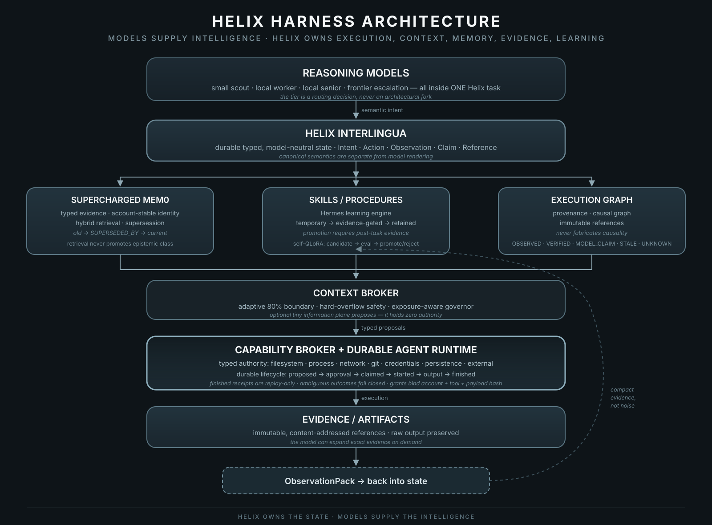
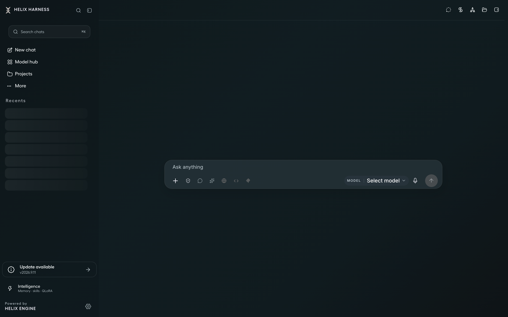
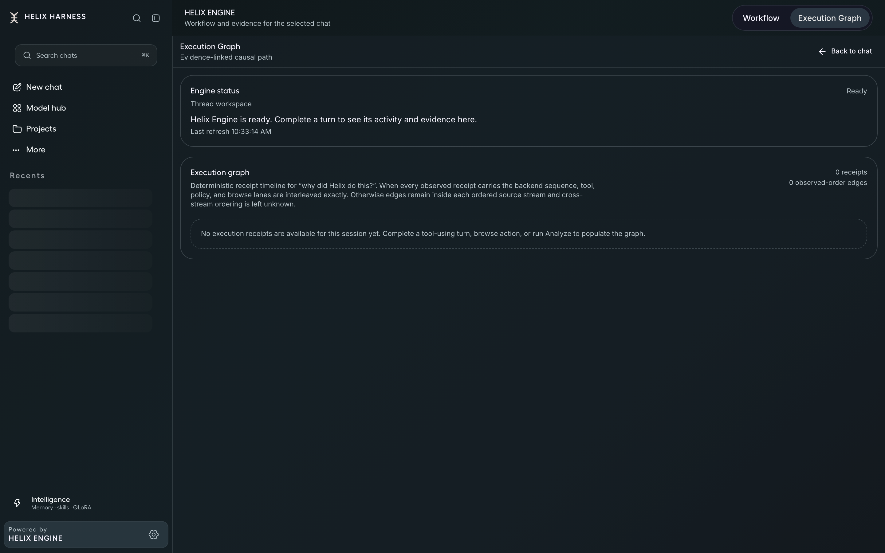

<p align="center">
  
</p>

# Helix Harness v3

**A durable runtime for autonomous agents. Helix owns execution, context, memory, evidence, and learning. The model supplies intelligence.**

> **Built on the Unsloth foundation, substantially extended and hardened through Helix.**

Helix Harness is a local-first autonomous-agent workstation for macOS. Models are *disposable reasoning resources*. The durable substrate around them holds task state, tools, approvals, capability boundaries, context, memory, skills, artifacts, provenance, checkpoints, recovery, finalization, and the learning lifecycle.

Helix Harness is a fork and derivative of [**Unsloth Studio**](https://github.com/unslothai/unsloth), developed by the Unsloth AI Inc. team. Unsloth supplies the model-loading, training, quantized-inference, Apple-Silicon/MLX, GGUF/llama.cpp, and desktop foundation. Helix adds the durable control plane and product layer, with extensive engineering and validation under hostile conditions. This is not an upstream Unsloth release and does not imply endorsement. See [Credits](CREDITS.md) and [License](LICENSE).

> [!WARNING]
> **v3 is the first integrated Helix release and remains under active development.** The agent runtime, memory, evidence, and learning substrate are real and load-bearing. The v3 release gate was static package qualification (identity, signature, and bundle integrity) — not behavioral validation; the frozen hostile-audited baseline it carries forward is documented in [`docs/helix-reliability-baseline-v2.1-public.md`](docs/helix-reliability-baseline-v2.1-public.md). Some inherited Studio surfaces remain in transition, some controls/providers are incomplete, and interfaces and packaging will keep changing. Back up important data. The app is ad-hoc signed and not Apple-notarized.

---

## Why v3? — the lineage, honestly

We got the first two versions wrong in different ways.

| Version | What it was | What went wrong / right |
|---|---|---|
| **v1** | The first attempt. An idea, poorly executed. | The ambition was right. The implementation wasn't a usable foundation. |
| **v2** | We built the backend and durable runtime, but modules were **not tested together and not integrated properly**. | Individual modules passed in isolation. Put together, they did not hold up. |
| **v3** | **The first integrated Helix release.** Carries the frozen v2.1 hostile-audited baseline forward, and adds static package qualification of the shipped artifact. | Release-critical subsystems are tested together under crash, replay, recovery, concurrency, and hostile boundary conditions **as part of the v2.1 baseline**. The v3 gate itself verified artifact identity, bundle integrity, and signature — see [`docs/helix-v3-release-evidence.json`](docs/helix-v3-release-evidence.json). |

In v2, we mistook working parts for a working system. v3 is the first release to close that gap, integrating the subsystems into one shipped artifact and qualifying that artifact before release.

---

## The core idea

Most agent harnesses center on the model. Helix centers on the runtime.

<p align="center">
  
</p>

```
                        ┌──────────────────────────┐
                        │   any reasoning model    │   ← models are
                        │   (local or frontier)    │     REASONING
                        └────────────┬─────────────┘     RESOURCES
                                     │ semantic intent
                        ┌────────────▼─────────────┐
                        │    HELIX INTERLINGUA     │   ← typed, model-neutral
                        │  durable typed state     │     canonical state
                        └────────────┬─────────────┘
              ┌──────────────────────┼──────────────────────┐
              │                      │                      │
     ┌────────▼────────┐   ┌─────────▼─────────┐   ┌────────▼────────┐
     │ Supercharged     │   │ Skills /          │   │ Execution Graph │
     │ Mem0             │   │ procedures        │   │ + provenance    │
     │ typed evidence,  │   │ evidence-gated    │   │ immutable       │
     │ supersession     │   │ promotion         │   │ references      │
     └────────┬────────┘   └─────────┬─────────┘   └────────┬────────┘
              └──────────────────────┼──────────────────────┘
                        ┌────────────▼─────────────┐
                        │   Context Broker /       │
                        │   tiny information plane  │   ← optional, 0 authority
                        └────────────┬─────────────┘
                                     │ typed proposals
                        ┌────────────▼─────────────┐
                        │ Capability Broker +      │
                        │ Durable Agent Runtime    │   ← authority + exactly-once
                        └────────────┬─────────────┘
                                     │ execution
                        ┌────────────▼─────────────┐
                        │ Evidence / Artifacts     │
                        │ immutable references     │
                        └────────────┬─────────────┘
                                     │ ObservationPack
                                     └──▶ back into state
```

Helix owns execution, context, memory, evidence, and learning; models supply bounded intelligence. A small local scout, local worker, larger local senior model, or frontier escalation all reason *inside one Helix task*. Choosing a tier changes routing, not the architecture or agent system.

---

## What Helix owns (and why it matters)

These subsystems are implemented, and are carried forward from the v2.1 reliability baseline.

| Subsystem | What it does | Why it's hard (and what Helix does about it) |
|---|---|---|
| **Durable agent/tool runs** | Tool lifecycle with stable identities: `proposed → approval → claimed → started → output → finished`. | A finished receipt is **replay-only** and never re-executes. If execution started but no finish exists, only provably safe/idempotent ops recover; mutating/ambiguous ops **fail closed as unknown**. |
| **One logical turn** | A task/turn survives multiple physical generation segments, reloads, and lost HTTP responses. | Duplicate event delivery and frontend death never create a second side effect. |
| **Adaptive checkpoint & context governance** | Backend-authoritative context control with the exact **80% adaptive boundary** and hard-overflow safety. | "Configured for 32K" is not evidence 32K was exercised. Positive evidence is **exposure-aware**; OOM/pressure propagates conservatively. The served context is capped at whatever the *host's* actual memory headroom safely supports, not what a model advertises. |
| **Backend Turn Finalizer** | After the answer, the *backend* runs durable, restart-safe finalization: memory → optional bounded audit → Hermes → skill disposition → QLoRA admission → receipt. | Independent of frontend lifetime, idempotent per side-effect boundary, duplicate-worker safe, foreground-preemptible. The webview never triggers learning side effects for durable runs. |
| **Capability broker** | Typed authority: `filesystem.read/write`, `process.exec`, `network.egress`, `git.read/mutate`, `credentials.use`, `persistence.write`, `external.mutate`. | Grants specify authority beyond tool names. Network grants bind to **account + exact tool type + exact payload hash**. Symlinks, path replacement, and cwd/TOCTOU attacks are hostile-tested. Bypass Permissions is an explicit, separate mode. |
| **Inference-vs-training ownership** | QLoRA **never** trains during foreground inference. | Foreground inference preempts background audit/learning. Only **verified** training targets reach admission. Model self-audit is enrichment, never objective evidence. |
| **Provenance & epistemic classes** | Every claim carries `OBSERVED / VERIFIED / RETRIEVED / DERIVED / MODEL_CLAIM / HYPOTHESIS / STALE / UNKNOWN`. | A reducer or model can never silently upgrade `MODEL_CLAIM → VERIFIED` or `HYPOTHESIS → OBSERVED`. Mutation invalidates dependent verification. The Execution Graph never fabricates causality. |
| **Memory (Mem0 + hybrid retrieval)** | Account-stable, account-scoped memory with typed evidence, supersession (`old → SUPERSEDED_BY → current`), and hybrid retrieval. | Retrieval never promotes epistemic class. Default retrieval won't return obsolete and current assertions as equally valid. Qdrant failure is bounded, not fatal. |
| **Skills (Hermes)** | Learned procedures with **evidence-gated** promotion. | Promoting a temporary skill requires post-task evidence. |
| **Self-QLoRA learning lifecycle** | `experience → training candidate → train candidate → frozen eval → compare to control → promote/reject → durable receipt`. | Every learned behavior is evaluated against a frozen control before promotion; training alone cannot trigger a hot-swap. |
| **Crash/reload recovery** | Restart safety throughout; stale managed-runtime recovery; process/listener cleanup. | Duplicate workers, stale owners, and orphan processes are fenced by leases and identity. |
| **Account isolation** | Account scoping enforced through generation, tools, memory, learning, and recovery. | Hostile tests attempt account crossover. |
| **Adaptive runtime governor** | Memory pressure, swap/compression, MLX/Metal counters, resident footprint, KV config, hysteresis. | Auto-enabling a feature requires exposure-aware evidence of benefit for the hardware/model/context class. |

---

## The reliability philosophy (why you'd trust this and not the marketing)

v3 rests on the testing process. Extensive hostile testing of the backend — recorded in the v2.1 reliability baseline — mostly found things that were wrong: bugs to fix and hypotheses to reject.

Every optimization is measured against the **frozen, reproducible v2.1 reliability baseline**. v3 additionally applies a static package-qualification gate (artifact identity, bundle integrity, ad-hoc signature) over the bytes it ships. The following invariants are enforced and regression-tested as part of that baseline:

- exact 80% adaptive checkpoint boundary + hard overflow safety
- durable, idempotent checkpoint replay; no duplicated side effects after replay
- exactly-once / fail-closed tool recovery; unknown outcomes never silently retried
- worker ownership + lease fencing; durable approvals that survive reload
- exact approved-call recovery before new model sampling
- account scoping; approval/tool/payload/checkpoint identity binding
- typed capability + filesystem/network/process confinement
- Stop/cancel; bounded tool output
- durable finalization; inference-vs-training ownership; post-answer-only QLoRA
- verified training-target gate; Mem0 account identity
- evidence vs model-claim distinction; temporary-skill evidence gate
- packaged backend identity; clean backend/process teardown

Adversarial test classes in the v2.1 baseline include: kill after side-effect but before receipt, duplicate workers, duplicate event replay, frontend death, backend death, lost HTTP response, SQLite lock, stale runtime, Qdrant unavailable, disk/output pressure, huge stdout, cancellation at every boundary, foreground request during audit/training, account-crossover attempts, stale capability grants, symlink/path races, adaptive checkpoint during tools, and app restart during finalization.

---

## Install (macOS, Apple Silicon)

```bash
/bin/bash -c "$(curl -fsSL https://raw.githubusercontent.com/SuperHelix77/Helix-Harness/v3.0.1/scripts/install_helix_harness_v3.sh)"
```

The installer downloads the app and published checksum from the [v3.0.1 release page](https://github.com/SuperHelix77/Helix-Harness/releases/tag/v3.0.1), verifies the archive before extraction, and installs into `~/Applications`. It installs as **Helix Harness v3** with bundle ID `ai.helix.harness.v3`, so an existing v2 installation is left untouched. Set `HELIX_INSTALL_DIR` before running to choose another destination.

The app is ad-hoc signed and not Apple-notarized. macOS will ask you to confirm first launch.

---

## The v3 workspace

<p align="center">
  
</p>

Chat is the product. Memory, skills, learning, and the execution graph stay available without taking over the conversation.

- **Conversation-first.** A large chat surface, lightweight composer, and subdued secondary metadata. Workflow and the Execution Graph appear in the right rail when relevant.
- **Transparency.** Main-window, sidebar, conversation, composer, and right-rail translucency have independent, persisted controls. CSS and native macOS vibrancy work together; text stays fully opaque and readable at every setting. Turning transparency off gives a fully opaque, deterministic surface.
- **One workspace.** A restrained macOS-native hierarchy with minimal chrome and a sidebar that recedes visually.
- **Model choice** lives in the composer (`Select model`) and the **Model hub**. Pick local or frontier reasoning per task.
- **Helix Engine** keeps memory, execution, and learning in the same lifecycle. They are built in, not optional sidecars.

<p align="center">
  
</p>

---

## Who's underneath

We get to build Helix because the [Unsloth AI](https://github.com/unslothai/unsloth) team built Unsloth Studio. Model loading, training, quantized inference, MLX/Apple-Silicon, GGUF/llama.cpp, the desktop foundation: all of that work is underneath this project. It's a lot to inherit, and we're grateful. Thank you for giving us so much to build on.

This project is a fork/derivative and keeps upstream's licensing: `studio/*` and `unsloth_cli/*` are AGPL-3.0, everything else is Apache-2.0. Unsloth's original copyright and SPDX/license notices are retained where applicable. Helix Harness does not imply sponsorship, endorsement, or release ownership by Unsloth.

---

## Support the project

Helix Harness is developed in the open. If it's useful to you, a coffee helps us keep working on it:

<p align="center">
  <a href="https://buymeacoffee.com/superhelix7">☕ Buy me a coffee</a>
</p>

---

## Contributing

See [CONTRIBUTING.md](CONTRIBUTING.md) and [CODE_OF_CONDUCT.md](CODE_OF_CONDUCT.md). This project is ad-hoc signed, in active development, and interfaces will change.

## License

Dual-licensed as inherited from upstream: AGPL-3.0 for `studio/*` and `unsloth_cli/*`, Apache-2.0 for the rest. See [LICENSE](LICENSE) and `studio/LICENSE.AGPL-3.0`. Upstream attribution in [CREDITS.md](CREDITS.md).
